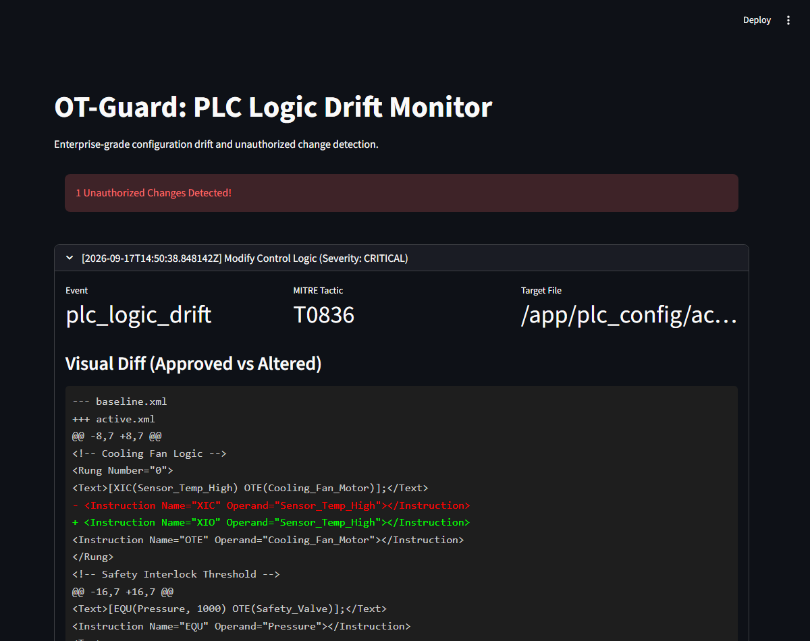

# OT-Guard: PLC Logic Drift Detector

Detects silent, unauthorized changes to PLC ladder-logic configuration files
and raises a SIEM-ready alert with a visual diff of exactly what changed.

**Built for the Adani Cyber Sanjeevni Hackathon 2026 (Track 2).**

## Overview

In Operational Technology (OT) environments, a silent unauthorized edit to
PLC logic — e.g. flipping a safety interlock from Normally Open to Normally
Closed, or quietly raising a pressure threshold — can cause real physical
damage. Conventional IT File Integrity Monitors (FIM) either miss this
entirely or drown it in false positives from PLC files' own volatile
metadata (export timestamps, live counters). OT-Guard watches a PLC project
file, strips the volatile noise, and alerts only on genuine logic changes.

## Why it exists

Built as a hackathon submission for Adani Cyber Sanjeevni 2026 (Track 2),
targeting exactly this OT-specific detection gap. It's a working
proof-of-concept, not a production ICS security product — see Known
limitations for what that distinction actually means here.

## Features

- **Structural XML parsing.** Uses `lxml` to parse the PLC project file,
  strip volatile attributes (`ExportDate`, `ExportOptions`, `Owner`,
  `SoftwareRevision`) and volatile tag values, then canonicalizes what's
  left (`c14n`) so only real structural logic changes trigger an alert.
- **Baseline signature.** The normalized "known good" state is signed with
  HMAC-SHA256 at engine startup, and drift checks use a constant-time
  comparison (`hmac.compare_digest`) rather than a naive string compare.
- **Real-time monitoring.** Uses `watchdog` to hook into filesystem events
  for the PLC config directory, detecting changes with sub-second latency.
- **SIEM-ready alerts.** Every detected drift is appended to a JSON Lines
  ledger, tagged with **MITRE ATT&CK for ICS T0836 (Modify Control
  Logic)** — a format any SIEM (Splunk, Wazuh, Elastic) can ingest
  directly.
- **Visual diff dashboard.** A Streamlit dashboard renders each alert as a
  line-level diff of the approved vs. altered logic.
- **Attack simulation tool** for live demos, and the whole thing runs as
  three decoupled Docker services (engine, dashboard, attacker).

## Demo

```bash
docker compose up -d --build engine ui
# ... then, in another terminal:
docker compose run --rm attacker
```

The attacker service rewrites `plc_config/active.xml` — flipping an `XIC`
(Examine-If-Closed) instruction to `XIO` (Examine-If-Open) and raising a
safety pressure threshold from `1000` to `5000` — and the engine detects it
within about a second:

```
engine-1  | [*] File change detected: /app/plc_config/active.xml
engine-1  | [CRITICAL] Drift detected in /app/plc_config/active.xml. Alert logged.
```

The dashboard at `http://localhost:8501` then shows:



## Tech stack

- **Language:** Python 3.10
- **XML processing:** `lxml` (parsing, c14n canonicalization)
- **File monitoring:** `watchdog`
- **Dashboard:** `streamlit`
- **Deployment:** Docker / Docker Compose

## How it works

- **`engine/parser.py`** (`L5XParser`) normalizes a PLC project XML file —
  strips volatile attributes and tag values, canonicalizes the result —
  and signs that normalized form with HMAC-SHA256.
- **`engine/monitor.py`** syncs `active.xml` to the trusted `baseline.xml`
  at startup, signs the baseline, then uses `watchdog` to re-check the
  signature on every subsequent file write. A mismatch produces a
  unified diff (`difflib`) between the last-known-good and current
  normalized content.
- **`engine/logger.py`** appends each detected drift to
  `logs/drift_alerts.jsonl` as a structured, MITRE-ATT&CK-tagged event.
- **`ui/app.py`** is a Streamlit dashboard that reads that same log file
  and renders each alert with a color-coded line diff.
- **`tools/simulate_attack.py`** is the demo "attacker" — it directly
  edits `active.xml` to simulate an insider silently altering ladder logic.

## Installation

Requires Docker and Docker Compose. No local Python install is needed —
everything runs in containers.

```bash
git clone <this repo>
cd plc-drift-detector
docker compose up -d --build engine ui
```

The Compose file sets a demo-only `OT_GUARD_SECRET_KEY` for local runs (see
Known limitations) — a real deployment must supply its own via a secrets
manager or an uncommitted `.env` file, not this repo's default.

## Usage

1. Start the engine and dashboard: `docker compose up -d --build engine ui`.
2. Open `http://localhost:8501` — it starts in the "Secure" state.
3. Simulate an attack: `docker compose run --rm attacker`.
4. Refresh the dashboard to see the alert and its visual diff.
5. `docker compose down` to stop everything.

## Project structure

```
plc-drift-detector/
  engine/
    parser.py     # XML normalization + HMAC-SHA256 signing
    monitor.py     # watchdog-based file monitoring + drift detection
    logger.py       # SIEM-ready JSONL alert logging
  ui/
    app.py          # Streamlit visual-diff dashboard
  tools/
    simulate_attack.py  # demo "attacker" that mutates active.xml
  plc_config/
    baseline.xml    # the trusted "known good" PLC logic
    active.xml       # the live/monitored file (synced from baseline at startup)
  logs/
    drift_alerts.jsonl  # generated at runtime, not committed
  docker-compose.yml
  Dockerfile
```

## Testing

```bash
python -m venv venv
source venv/bin/activate  # Windows: .\venv\Scripts\activate
pip install -r requirements-dev.txt
pytest -v
```

The suite calls the real `L5XParser` against real XML files on disk:
normalization, HMAC signing, drift detection on an actual altered
instruction, the fail-closed behavior when no secret is configured, and a
test that documents the volatile-attribute gap described below.

## Known limitations

- **Volatile-value stripping only clears element text, not attributes.**
  `normalize_xml()` sets a `<Data>` tag's *text* to empty to filter out
  volatile live values, but every `<Data>` tag in this project's own PLC
  files encodes its value as a `Value` *attribute*
  (`<Data Value="1000"/>`), not text. That's exactly why the demo's
  pressure-threshold tampering (also a `Value` attribute) is correctly
  caught — but it also means a genuinely volatile field using the same
  attribute-based encoding (e.g. a live scan counter) would falsely
  trigger an alert on every change instead of being filtered as noise.
  There's no way to distinguish "volatile telemetry" from
  "security-critical configuration" from the XML shape alone right now —
  a real version would need an explicit allow-list of which tags/paths
  count as volatile. Covered by
  `tests/test_parser.py::test_data_value_attribute_changes_are_never_treated_as_volatile_noise`.
- **Trust-on-first-use, not a chain of custody.** The engine trusts
  whatever `baseline.xml` is present on disk at startup and signs it then
  — there's no separate, out-of-band verification that the baseline
  itself hasn't already been tampered with before the engine ever reads
  it. In this design the HMAC signature protects against the ladder-logic
  file drifting *after* startup, not against a compromised baseline. A
  production version would need the baseline delivered and attested by a
  separate, trusted channel.
- **The demo secret is checked into `docker-compose.yml`.** It's clearly
  labeled as demo-only, but a real deployment must override
  `OT_GUARD_SECRET_KEY` with its own value from a secrets manager. The
  engine now refuses to start without one being set — it no longer falls
  back to a value hardcoded in the source (an earlier version did, which
  would have let anyone reading this public repo forge a matching
  signature).
- **The attack simulation is a simple text substitution**, not a realistic
  attacker workflow against a real Rockwell/Siemens engineering
  workstation — it's there to exercise the detection pipeline end to end
  in a demo, not to model a real intrusion.
- **No authentication on the Streamlit dashboard.** Fine for a local demo,
  not for a real SOC-facing deployment.

## License

MIT — see [LICENSE](LICENSE).
